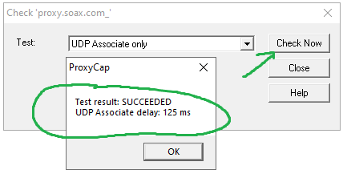

# BAS Project Requirements and Guidelines

## Project Overview

This guide outlines key requirements and systematic procedures for effectively executing projects
using [Browser Automation Studio (BAS)](https://bablosoft.com/shop/BrowserAutomationStudio).

BAS is a versatile tool enabling rapid development of various applications with no programming skills needed.

Browser Automation Studio offers a user-friendly platform for creating applications utilizing browser automation, HTTP
client, email client, and other integrated libraries. It's ideal for developing a wide range of applications, including
but not limited to poster creation, spam tools, data parsers, content uploaders, and social network automation apps.

### Research and Analysis

1. **Research Target Website**:
    - Conduct an in-depth analysis of the target website's structure, technology stack (such as Perfect Canvas), and
      user interaction patterns.
    - Identify potential automation challenges, such as dynamic content, security measures, and CAPTCHAs.
    - Utilize resources like the [Perfect Canvas Guide](https://wiki.bablosoft.com/doku.php?id=perfectcanvas) for
      advanced insights and strategic planning.

2. **Choose Your Proxy Provider**:
    - Select a proxy provider that meets the specific needs of your project, considering:
        - **Proxy Types**:
            - Residential: Ideal for mimicking real user behavior with residential area IPs.
            - Mobile (LTE modems in a static location): Suitable for mobile device activity emulation but not
              recommended for account creation on platforms like Google or Facebook.
            - Datacenter: Provides fast and stable IPs from data centers but may have a higher detection risk.
        - **Size of Proxy Pool**: Choose providers with a large and diverse proxy pool to ensure a consistent supply of
          fresh IPs and reduce reuse risks.
        - **Geographical Locations**: Opt for proxies in regions relevant to your target website.
        - **Rotation Capabilities**: Select providers offering IP rotation to reduce detection risks, thus enhancing
          automation effectiveness.
        - **Session Control**: Ensure session persistence is possible, maintaining the same IP for the entire session
          when needed.

### Important Note on UDP Proxy Compatibility with BAS

BAS may not support all proxies using the UDP protocol due to specific library dependencies and compatibility
constraints with certain proxy protocols. Ensure your chosen proxy provider's services are compatible with BAS and
support UDP-based communication.

- Confirmed Proxy Software **Compatible** with UDP Proxies in BAS:
    - Dante (SOCKS server): [Dante - A free SOCKS server](https://www.inet.no/dante/)
    - MikroTik RouterOS (SOCKS Proxy): [MikroTik Wiki - Manual:IP/SOCKS](https://wiki.mikrotik.com/wiki/Manual:IP/SOCKS)
    - ProxyCap (network traffic redirection): [ProxyCap](https://www.proxycap.com/)

- Confirmed Proxy Software **Incompatible** with UDP Proxies in BAS:
    - Proxifier: [Proxifier](https://www.proxifier.com/)
    - GoProxy: [GoProxy](https://github.com/snail007/goproxy)
    - Gost: [Gost](https://github.com/go-gost/gost)

### Working with ProxyCap and BAS

Integrating ProxyCap with BAS requires careful setup for accurate proxy functionality.

#### Limitations of ProxyCap with BAS

ProxyCap configures settings on an application-wide basis, not per browser instance. Therefore, only one browser thread
per proxy setup is feasible within BAS at a time. ProxyCap cannot differentiate between browser instances based on
command-line parameters, limiting the use of multiple profiles with different proxies simultaneously.

#### Pre-requisites:

- Start ProxyCap before running BAS scripts.
- Align ProxyCap's settings with the BAS browser profile to ensure consistent proxy usage.

### Workflow:

1. **Prepare ProxyCap for Traffic Handling**:
    - Configure ProxyCap to specifically route traffic to `ip.bablosoft.com`. This step is crucial for setting up the
      proxy correctly for the upcoming tasks. Additionally, confirm that your chosen proxy supports the UDP protocol.
    - In ProxyCap, establish a rule to guide traffic from BAS browsers to the selected proxy. This rule ensures that the
      browser's network requests are consistently processed through the chosen proxy.

2. **Execute BAS Script**:
    - The script incorporates a dual-phase approach for configuring the browser:
        - **Set Proxy in Browser**: Begin by configuring the browser’s proxy settings. This step is essential for
          assigning the accurate geolocation and timezone that correspond to the proxy’s location.
        - **Reset Proxy Settings**: Following the initial configuration, reset the proxy settings to their default
          values. Crucially, retain the geolocation and timezone settings established earlier. This approach ensures
          that the browser maintains the geographical and temporal settings associated with the proxy location, even
          when the proxy itself is not in use.

#### Workflow in Detail:

- Configure a ProxyCap rule to redirect traffic for `*.bablosoft.com` to your chosen proxy.
  

- Check if your proxy supports the UDP protocol.
  

- In ProxyCap, assign a Display Name to your proxy matching the BAS browser profile directory you plan to use. Remember
  to select the Chromium browser's file path used by the BAS script.
  Common paths for non-compiled BAS scripts' Chromium executable include:
    - `C:\Users\Administrator\AppData\Roaming\BrowserAutomationStudio\apps\26.4.0\Worker.7\chrome\chrome.exe`
    - `C:\Users\Administrator\AppData\Roaming\BrowserAutomationStudio\apps\26.4.0\Worker.8\chrome\chrome.exe`

  

- Set distinct ProxyCap rules to direct BAS browser traffic to the specified proxy. Adjust these rules as needed for
  different tasks or browser profiles.
  

- Run the BAS script and verify that traffic routes correctly through the proxy.

An example BAS script is available at [docs/bas_projects/example.xml](docs/bas_projects/example.xml).

If you follow these steps and the script executes successfully, you are on the right track.

These steps will assist in effectively managing BAS browser profiles with ProxyCap, despite limitations regarding UDP
proxies.
